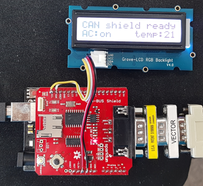

# Arduino CAN LCD
This is a simple example using an Arduino to display on a I²C LCD some information coming from the CAN bus over SPI with a MCP2515 controller, and sending CAN frames when the buttons are pressed.



## Hardware parts
- Arduino
- Grove RGB backlight: http://wiki.seeedstudio.com/Grove-LCD_RGB_Backlight/
- CAN shield: https://www.sparkfun.com/products/13262

## Required libraries
- https://github.com/Seeed-Studio/Grove_LCD_RGB_Backlight
- https://github.com/sparkfun/SparkFun_CAN-Bus_Arduino_Library

## Examples
Below are some examples of [can-utils](https://github.com/linux-can/can-utils) calls to send CAN frames to the Arduino through the can0 device of a Linux host.

### Set the HVAC information to AC on and temperature 19°C
```bash
$ cansend can0 100#0113
```

### Display "hello world!" on the first line
```bash
$ cansend can0 200#48656c6c6f20776f
$ cansend can0 201#726c642120202020
```

### Change the LCD backlight color to green
```bash
$ cansend can0 300#00ff00
```

### View the CAN frames sent when pressing a button
```bash
$ candump can0
  can0  400   [8]  00 01 02 03 04 05 06 07
  can0  404   [8]  00 01 02 03 04 05 06 07
  ...
```
